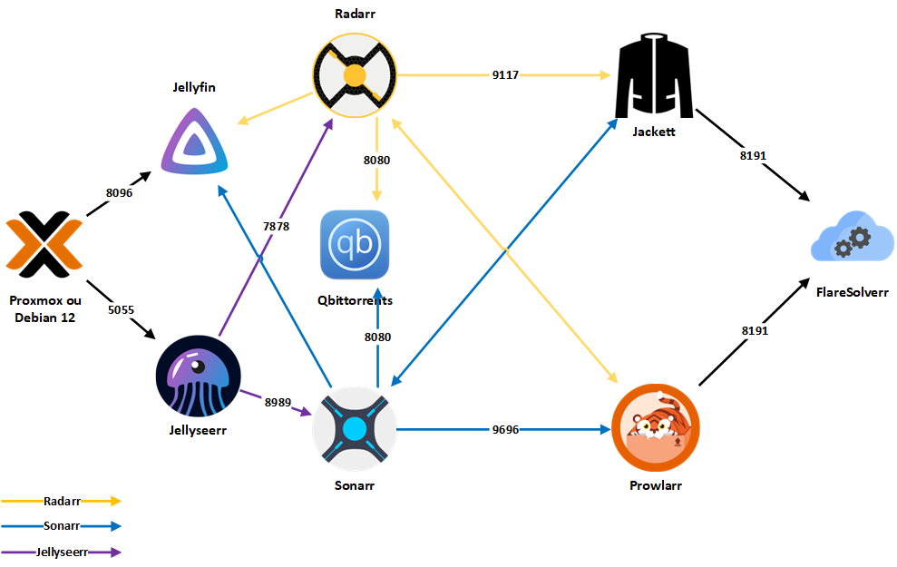

# **All-jellyfin-media-server**

<div style="text-align: center">
    
</div>


Welcome to the All-jellyfin-media-server Repository! This repository contains everything you need to create your own Jellyfin media server with Sonarr, Radarr, Jellyseerr, Prowlarr, qBittorrent (via Gluetun VPN), plus utility services like Homepage and Traefik for subdomain access. We'll refer to the compilation of all containers as **Jellyflix** to keep it simple.


 

[](https://github.com/Morzomb/All-jellyfin-media-server/commits/master)


## **Table of contents**

- [**All-jellyfin-media-server**](#all-jellyfin-media-server)
  - [**Table of contents**](#table-of-contents)
  - [**What is Jellyflix for?**](#what-is-jellyflix-for)
  - [**Services Overview**](#services-overview)
- [**Prerequisites**](#prerequisites)
  - [**Docker**](#docker)
  - [**VPN**](#vpn)
  - [**Troubleshoot VPN**](#troubleshoot-vpn)
- [**Installation**](#installation)
  - [**1. Storage  Configuration**](#storage-configuration)
  - [**3. Steps**](#steps)
- [**Accessing Applications**](#accessing-applications)
- [**Web UI configuration (optional)**](#web-ui-configuration-optional)
- [**Updating Applications**](#updating-applications)
- [**Disclaimer**](#disclaimer)

## **What is Jellyflix for?**

This repository allows you to create your own Jellyfin media server with all the necessary tools to manage your movies, TV shows, music, and eBooks. It also includes tools to automate the downloading of new content and to protect your privacy using a VPN.

Jellyflix uses Docker + Docker Compose to deploy the services. The compose file lives under `compose_files/`.

> [!IMPORTANT]  
> To use Docker Compose, make sure Docker is installed on your system.

---

## **Services Overview**

| Service | Description |
|---------|-------------|
| **[Jellyfin](https://jellyfin.org/)** | Open-source media server software that allows you to stream your movies, TV shows, music, and eBooks to all your devices. Compatible with many types of media files and supports streaming to numerous devices. |
| **[Jellyseerr](https://github.com/Fallenbagel/jellyseerr)** | Open-source application that automates the management of your Jellyfin media server. Monitors your Jellyfin library and automatically searches for and downloads new content based on your preferences. Integrates with Sonarr and Radarr for seamless media management. |
| **[Sonarr](https://sonarr.tv/)** | TV show management software that allows you to search, download, and manage your favorite TV shows automatically. Works with many types of trackers and torrent clients and supports automatic subtitle downloading. |
| **[Radarr](https://radarr.video/)** | Movie management software that allows you to search, download, and manage your favorite movies automatically. Works with many types of trackers and torrent clients and supports automatic subtitle downloading. |
| **[Traefik](https://traefik.io/traefik/)** | Reverse proxy that lets you access services by subdomain (example: `http://sonarr.kewpie.top`) instead of remembering ports. |
| **[Homepage](https://gethomepage.dev/)** | Dashboard for your services (config version-controlled in `homepage/`). |
| **[Flaresolverr](https://github.com/FlareSolverr/FlareSolverr)** | Open-source software that allows you to bypass streaming restrictions on video-sharing sites. Resolves streaming links and bypasses geographical blocks and playback restrictions. |
| **[Prowlarr](https://github.com/Prowlarr/Prowlarr)** | Download management software that allows you to search for and automatically download files from many types of sources, including torrent trackers, newsgroups, and direct download sites. |
| **[qBittorrent](https://www.qbittorrent.org/)** | Open-source BitTorrent client software that allows you to download torrent files. Lightweight, easy to use, and supports many advanced features such as built-in torrent search, encryption, torrent creation, and support for private trackers. |
| **[Gluetun (VPN)](https://github.com/qdm12/gluetun)** | Open-source VPN client software that allows you to connect to VPN servers. Easy to use and supports many advanced features such as port forwarding, DNS leak protection, and support for multiple VPN protocols. |

---

# **Prerequisites**

> [!NOTE]  
> This service requires a machine with at least 4 CPU cores and 8 GB of RAM. It is also highly recommended to have an NVIDIA GPU for optimal performance.

Première chose à faire mettre à jour votre systèmes :

```bash
sudo apt update && sudo apt upgrade
```

## **Docker**

Install Docker using the official instructions for your OS:

- [Docker Engine install docs](https://docs.docker.com/engine/install/)

**[`^        back to top        ^`](#table-of-contents)**

# **VPN**

Personally, I use Surfshark VPN, but you can find a number of other VPN providers as well. The instructions for all the providers are [HERE](https://github.com/qdm12/gluetun-wiki/tree/main/setup/providers). Follow those instructions to setup and customize.
If you are using Surfshark you need to follow the isntructions there and look at the env file to see what environment variables you need.

## **Troubleshoot VPN** 

Once the Docker is launched, you can test your VPN with the following command :

```bash
docker exec qbittorrent curl -s https://api.ipify.org/
# Result
94.101.115.63
```

On my side, it shows me an IP address in Belgium :

<div style="text-align: center">
    
</div>

**[`^        back to top        ^`](#table-of-contents)**

---

# **Installation**
## **Storage Configuration**

This setup uses a **separated storage approach** for better performance and organization. You'll need to configure the paths directly in `compose_files/docker-compose.yaml` according to your system setup.

### **Recommended Directory Structure**
```
/home/mediaserver/configs/          # Service configurations
├── qbittorrent/
├── sonarr/
├── radarr/
├── jellyfin/
├── jellyseerr/
└── prowlarr/

/home/mediaserver/downloads/        # qBittorrent downloads (fast local storage)
├── radarr/                         # Movie downloads
├── sonarr/                         # TV show downloads  
└── completed/                      # Completed downloads

/mnt/external-drive/media/          # External drive for media
├── movies/                         # Movie files
└── tv-shows/                      # TV show files

/mnt/external-drive/audio/         # External drive for audio
└── music/                         # Music files

/mnt/external-drive/books/          # External drive for books
└── ebooks/                        # E-book files
```

> [!TIP]
> This setup allows downloads to happen on fast local storage first, then you can move/organize them to external drives later using Sonarr/Radarr's file management features.

## **Steps**


1. **Clone the repository**

```bash
git clone https://github.com/s-ashwinkumar/media-server.git
cd media-server/
```

2. **Configure Environment Variables**
Before proceeding, navigate to the `.env` file located in the `compose_files/` directory and complete it with the required information. This file must always be at the root of the `docker-compose` file you are going to launch.

```bash
cp compose_files/.env.example compose_files/.env
```

> [!WARNING]  
> Make sure you configure your Surfshark VPN credentials in the `.env` file. This step is essential for establishing a proper VPN connection for secure downloads.

3. **Configure Storage Paths**
Edit `compose_files/docker-compose.yaml` to set your storage paths according to your system setup. Update the volume mounts for each service to point to your desired directories.

4. **Start the Media Server**
   ```bash
   cd compose_files/
   docker compose up -d
   ```

## **Homepage Dashboard Configuration**

This repo supports the [Homepage](https://gethomepage.dev/) dashboard. The Homepage config is kept **in this git repo** so it can be version controlled:

- **Repo path (version controlled)**: `homepage/`
- **Runtime path (expected by the container)**: `/home/mediaserver/mediaserver/homepage`

On the host, `/home/mediaserver/mediaserver/homepage` is a **symlink** pointing to `~/code/media-server/homepage`. This lets Docker keep using the existing bind mount paths while you commit changes in git.

- **Logs**: Homepage logs are written under `homepage/logs/` and are **git-ignored**.
- **After changing config**: restart Homepage:

```bash
cd compose_files/
docker compose up -d homepage
```

5. **Access the Services**
   - Recommended (Traefik): `http://sonarr.<your-domain>`, `http://radarr.<your-domain>`, etc. (example: `http://sonarr.kewpie.top`)
   - Traefik dashboard: `http://traefik.<your-domain>` (or `http://<server-ip>:8083`)
   - Legacy (direct ports): still work if you use them, e.g. `http://<server-ip>:8989`

**[`^        back to top        ^`](#table-of-contents)**

# **Accessing Applications**

Once the applications are deployed, the recommended access method is via Traefik subdomains.

> [!IMPORTANT]
> Replace `<your-domain>` with the value you set in `TRAEFIK_DOMAIN` (example: `kewpie.top`).

- Jellyfin: `http://jellyfin.<your-domain>`
- Jellyseerr: `http://jellyseerr.<your-domain>`
- Sonarr: `http://sonarr.<your-domain>`
- Radarr: `http://radarr.<your-domain>`
- Prowlarr: `http://prowlarr.<your-domain>`
- qBittorrent: `http://qbittorrent.<your-domain>`
- Homepage: `http://homepage.<your-domain>`
- Traefik: `http://traefik.<your-domain>`

Gluetun (Surfshark VPN) will be automatically configured to be used with the applications.

# **Web UI configuration (optional)**

The full click-through setup guide for qBittorrent / Radarr / Sonarr / Prowlarr / Jellyfin / Jellyseerr has been moved here:

- `docs/WEB_UI_CONFIGURATION_GUIDE.md`

---

# **Updating Applications**

To update the applications, you need to stop the running containers and remove the existing Docker images. You can use the following commands to perform these operations:

```bash
docker compose down
docker image prune -a
```

Then, you can run `docker compose up -d` to restart the containers with the latest versions of the applications.

**[`^        back to top        ^`](#table-of-contents)**

# **Disclaimer**

This code is provided for informational purposes only and should not be used for illegal activities. I am not responsible for the actions performed by users of this code. This code is for informational purposes, and if people wish to use it, they should consult the laws of their countries.
