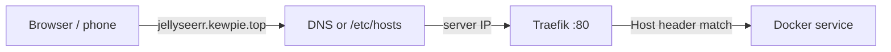

# Architecture

## Request flow



1. Client resolves `jellyseerr.<TRAEFIK_DOMAIN>` to the server IP.
2. HTTP hits Traefik on port 80 with `Host: jellyseerr.<domain>`.
3. Traefik matches Docker labels on the target container and proxies to its internal port.

Traefik discovers routes from container labels in `compose_files/docker-compose.yaml`, e.g.:

```
Host(`jellyseerr.${TRAEFIK_DOMAIN:-local}`) → jellyseerr:5055
```

## Network layout

```
                    ┌─────────────────────────────────────┐
  LAN / Tailscale   │  Traefik (:80, dashboard :8083)    │
        │           │  Sonarr, Radarr, Jellyfin, ...      │
        └──────────►│  Homepage, Prowlarr, Bazarr, ...    │
                    │                                     │
                    │  surfshark (Gluetun VPN)            │
                    │    └── qbittorrent (shared network) │
                    └─────────────────────────────────────┘
```

- All services share the `vpn_network` bridge, except qBittorrent which uses `network_mode: service:surfshark` so torrent traffic goes through the VPN.
- Only Traefik, Gluetun (8080), and selected direct ports are published to the host.

## Data flow

1. **Torrents:** qBittorrent → `${DOWNLOADS_PATH}` (via VPN)
2. **Usenet:** SABnzbd → `${DOWNLOADS_PATH}`
3. **Import:** Sonarr / Radarr move completed downloads to `${TV_SHOWS_PATH}` / `${MOVIES_PATH}`
4. **Stream:** Jellyfin reads hot + cold storage paths
5. **Requests:** Jellyseerr → Sonarr / Radarr → download clients
6. **Indexers:** Prowlarr → FlareSolverr (when needed)

## Storage (from `.env`)

| Variable | Typical use |
|----------|-------------|
| `CONFIGS_PATH` | Per-service config directories |
| `DOWNLOADS_PATH` | In-progress and completed downloads |
| `JELLYFIN_CACHE_PATH` | Jellyfin transcode/cache |
| `TV_SHOWS_PATH` / `MOVIES_PATH` | Active media library |
| `COLD_TV_SHOWS_PATH` / `COLD_MOVIES_PATH` | Archive media |
| `BOOKS_PATH` | Books / audiobooks |

## Exposed ports

| Service | Host port | Traefik subdomain |
|---------|-----------|-------------------|
| Traefik | 80, 8083 | `traefik.<domain>` |
| qBittorrent (via VPN) | 8080 | `qbittorrent.<domain>` |
| Sonarr | 8989 | `sonarr.<domain>` |
| Radarr | 7878 | `radarr.<domain>` |
| Jellyfin | 8096, 8920 | `jellyfin.<domain>` |
| Jellyseerr | 5055 | `jellyseerr.<domain>` |
| Prowlarr | 9696 | `prowlarr.<domain>` |
| FlareSolverr | 8191 | `flaresolverr.<domain>` |
| Homepage | 3000 | `homepage.<domain>` |
| SABnzbd | 8082 | `sabnzbd.<domain>` |
| Filebrowser | 8081 | `filebrowser.<domain>` |
| Bazarr | 6767 | `bazarr.<domain>` |

Prefer Traefik subdomains for daily use; direct ports are useful for debugging.

## DNS options

| Scenario | How names resolve |
|----------|-------------------|
| Desktop on LAN | `/etc/hosts` — one entry per subdomain |
| Phone on LAN | Router/Pi-hole local DNS, or DNS rewrite app |
| Remote via Tailscale | Wildcard DNS → Tailscale IP, or Tailscale split DNS |
