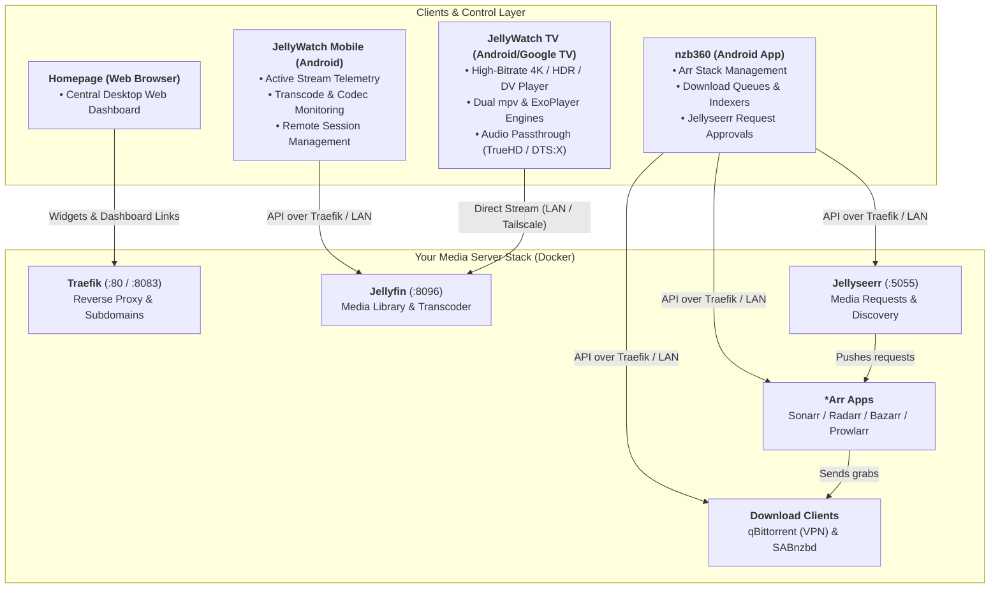

# Media Server Ecosystem: Current Setup vs. nzb360 vs. JellyWatch

This document visualizes how **nzb360** and **JellyWatch** layer on top of your existing Docker media stack.

---

## Architecture Diagram

---

## Layer Breakdown

| Layer | Component | Primary Use Case |
| :--- | :--- | :--- |
| **Media Playback** | JellyWatch TV / Official Jellyfin App | Watching media on TVs and streaming devices |
| **Server Telemetry** | JellyWatch Mobile / Jellyfin Admin / Jellystat | Monitoring who is watching, transcoding reasons, and bandwidth |
| **Download Automation** | nzb360 (Mobile) / Arr Web UIs | Triggering manual downloads, monitoring queues, approving requests |
| **Web Dashboard** | Homepage | Desktop-friendly launcher and status dashboard |
| **Infrastructure** | Docker Compose + Traefik | Host services, storage volumes, and reverse proxy routing |
